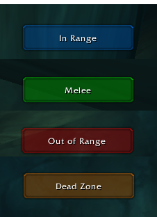

# Egnar
WoW 1.12.1 addon. Show a range indicator for hunters.

This addon will not work unless you are a hunter and have learned Wing Clip, this since it uses Wing Clip to check melee distance to target.

You need to configure the action slot for Wing Clip and Auto Shot by editing the lua code. Change the first lines in Egnar.lua. [Figure out what spot your Auto Shot is on](https://i.imgur.com/VGArn.jpg). This addon WILL NOT WORK if this is not done.

